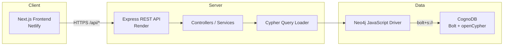
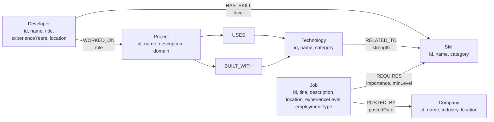
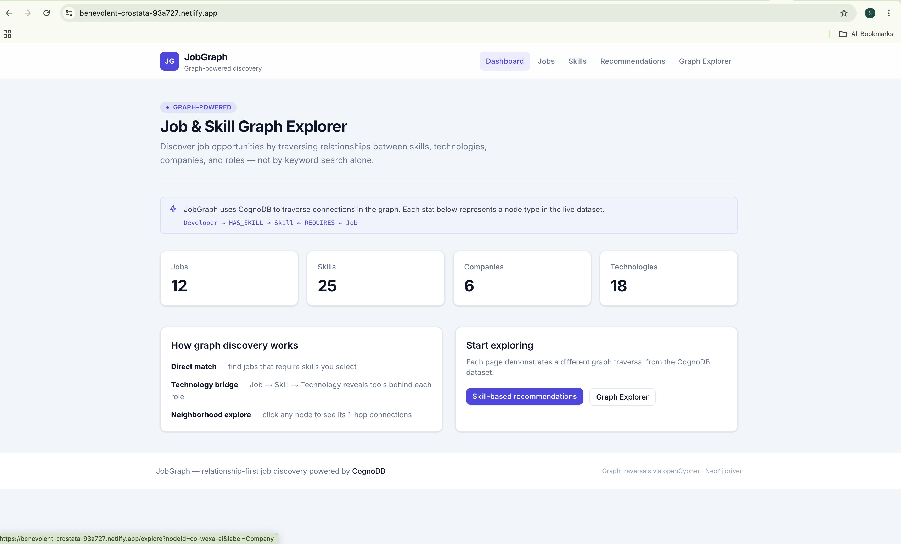
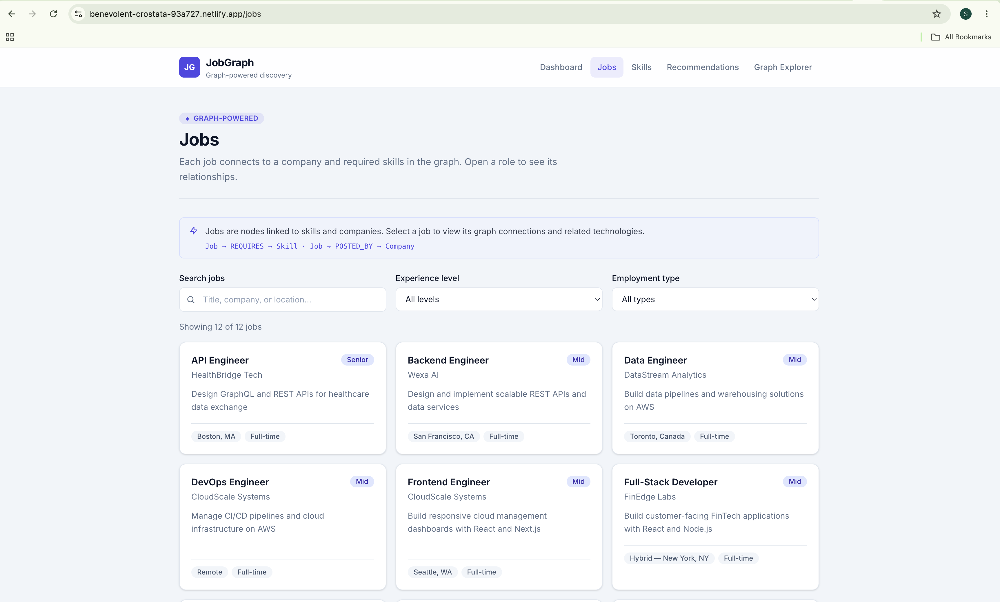
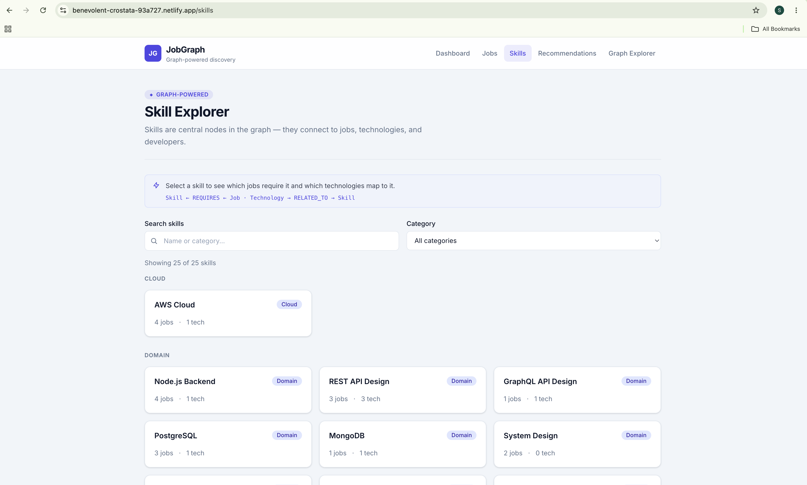
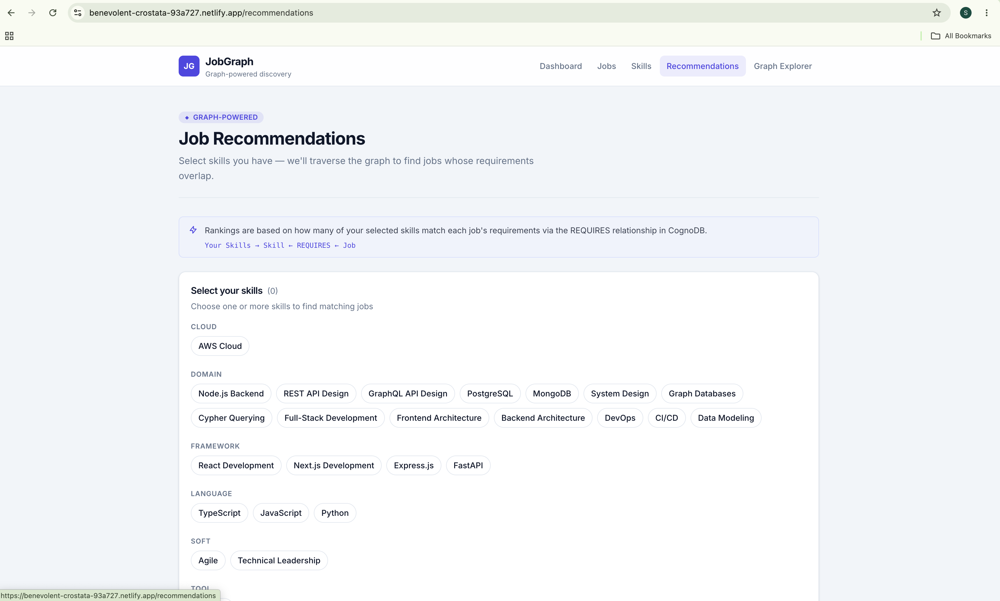
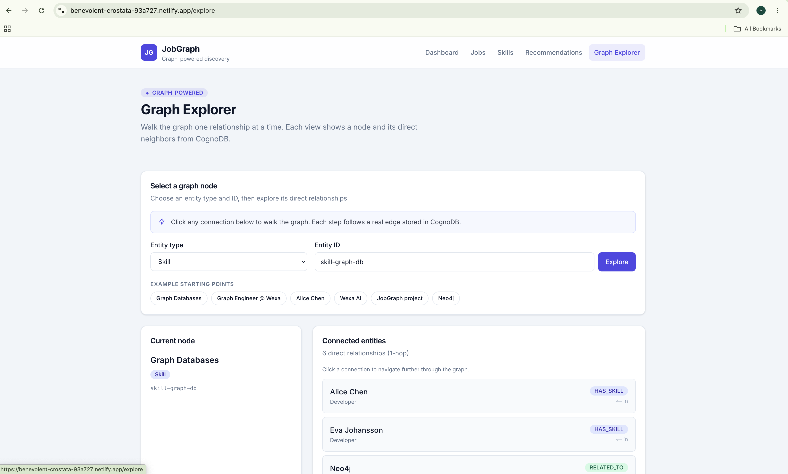

# JobGraph — Job & Skill Graph Explorer

A graph-powered web application for discovering jobs through skills, technologies, and relationships — built for the **Wexa AI CognoDB take-home assignment**.

| | |
|---|---|
| **Live demo** | https://benevolent-crostata-93a727.netlify.app |
| **Backend API** | https://wexa-ai-assignment-ma1t.onrender.com |
| **Health check** | https://wexa-ai-assignment-ma1t.onrender.com/api/health |

---

## 1. Overview

Traditional job boards treat listings as flat records: title, company, location, keywords. That works for browsing, but it hides the structure that actually drives hiring — **who requires which skills, which technologies imply those skills, and how people, projects, and companies connect**.

**JobGraph** is a relationship-first job and skill explorer. Instead of keyword search alone, it lets users:

- Browse **jobs** and **skills** as nodes in a graph
- See **required skills**, **connected technologies** (2-hop), and **1-hop neighbors** for any entity
- Get **ranked job recommendations** based on skill overlap via graph traversal
- **Walk the graph** one relationship at a time in an interactive explorer

The application reads from a live **CognoDB** instance populated with realistic seed data: 10 developers, 25 skills, 12 jobs, 6 companies, 10 projects, and 18 technologies. All discovery features are powered by **parameterized openCypher** queries — no mock data in the frontend.

---

## 2. Why a Graph Database?

JobGraph’s core problem is **relationship-centric**, not row-centric.

### Domain relationships

| Question | Graph path | Why it matters |
|---|---|---|
| Which jobs match my skills? | `Skill ← REQUIRES ← Job` | Jobs connect to skills by requirement edges, not a shared column |
| What tools sit behind a role? | `Job → REQUIRES → Skill ← RELATED_TO ← Technology` | Technologies relate to skills across a 2-hop bridge |
| Who worked with what stack? | `Developer → WORKED_ON → Project → BUILT_WITH → Technology` | Experience is a path through projects and tools |
| What is connected to this skill? | `Skill ← REQUIRES ← Job` and `Technology → RELATED_TO → Skill` | One skill node links hiring demand and tool ecosystems |
| How do I explore the dataset? | 1-hop neighborhood from any node | Native graph operation — not a pile of JOINs per edge type |

### Developers and skills

Developers possess skills with proficiency levels (`HAS_SKILL {level}`). A developer profile is a set of edges, not a comma-separated string. Matching and exploration follow those edges.

### Skills and jobs

Jobs require skills with importance and minimum level (`REQUIRES {importance, minLevel}`). Recommendations are computed by traversing these edges and ranking overlap — not by full-text search on job descriptions.

### Jobs and companies

Each job is posted by a company (`POSTED_BY`). Browsing a job reveals its employer; exploring a company reveals its open roles — both are graph traversals.

### Projects and technologies

Developers worked on projects; projects use and are built with technologies; technologies map to skills (`RELATED_TO {strength}`). This chain supports indirect discovery — experience with Neo4j on a project implies exposure to Graph Databases as a skill.

### Multi-hop relationships

Some questions span multiple hops. Example implemented in the app: **technologies related to a job’s requirements** (`Job → Skill → Technology`, 2 hops). A 4-hop query (`Developer → Project → Technology → Skill`) exists in the codebase and passes verification but is not yet exposed in the UI.

### Recommendations

Recommendations rank jobs by how many of the user’s selected skills match each job’s `REQUIRES` edges. The query returns match percentages and missing skills — all from one graph traversal, not N separate lookups.

### Graph traversal

The Graph Explorer walks the graph one step at a time: pick a node, view its direct neighbors with relationship type and direction, click to continue. This is the natural interaction model for relationship-first data.

### Comparison with a relational schema

In SQL, the same domain might use bridge tables:

```
developers ── developer_skills ── skills
jobs ── job_requirements ── skills
jobs ── companies
projects ── project_technologies ── technologies
technologies ── technology_skills ── skills
```

A 2-hop question (“technologies related to a job’s skills”) becomes multiple JOINs. That works for fixed hop counts, but each new path adds JOINs, the query obscures *why* entities connect, and variable-length exploration is awkward.

**Graph databases are not always better.** For simple CRUD, flat reporting, or domains where relationships are rarely traversed, PostgreSQL is often the right choice. JobGraph is intentionally graph-shaped because **traversal is the product**.

### Why CognoDB fits this application

[CognoDB](https://cognodb.com/) provides a managed graph database over the **Bolt protocol** with **openCypher** — the same query language used by Neo4j. JobGraph connects with the **official Neo4j JavaScript driver**:

- No custom SDK — standard driver, standard Cypher
- Relationship-first queries stay readable in `.cypher` files
- The assignment’s graph model (typed nodes, directed edges, multi-hop paths) maps directly to the domain
- Managed hosting removes operational overhead for a take-home demo

---

## 3. Features

All features below are **implemented** against live CognoDB data.

| Feature | Route | Description |
|---|---|---|
| Dashboard | `/` | Live counts of jobs, skills, companies, technologies |
| Job browser | `/jobs` | Search and filter by experience level and employment type |
| Job detail | `/jobs/[id]` | Required skills, connected technologies (2-hop), 1-hop graph connections |
| Skill browser | `/skills` | Search/filter by category; job and technology counts per skill |
| Skill detail | `/skills/[id]` | Related technologies, jobs requiring the skill, graph connections |
| Recommendations | `/recommendations` | Select skills → ranked jobs with match % and missing skills |
| Graph explorer | `/explore` | Pick any node, view 1-hop neighbors, click to walk the graph |
| Health check | `/api/health` | Backend and CognoDB connectivity status |

**Also included:** loading skeletons, empty states, error states with retry, responsive navigation, graph-path hints, skip-to-content link.

**Not implemented:** authentication, job/skill creation UI, write API endpoints.

---

## 4. Architecture



**Request flow:** Browser → Netlify (Next.js) → Render (Express) → parameterized Cypher → Neo4j driver → CognoDB → JSON `{ success, data, meta? }`.

Deployment details: [`docs/deployment.md`](docs/deployment.md)

---

## 5. Graph Data Model

Six node labels and seven directed relationship types. Every node has a stable string `id` with a uniqueness constraint.



**Seed dataset:** 10 developers · 25 skills · 12 jobs · 6 companies · 10 projects · 18 technologies

Full schema: [`database/schema/README.md`](database/schema/README.md)

---

## 6. Technology Stack

| Layer | Technology |
|---|---|
| Frontend | Next.js 15, React 19, TypeScript, Tailwind CSS v4 |
| Frontend hosting | Netlify |
| Backend | Express 4, TypeScript |
| Backend hosting | Render |
| Database | CognoDB (managed graph, Bolt + openCypher) |
| Driver | [neo4j-driver](https://neo4j.com/docs/javascript-manual/current/) v5 |
| Monorepo | npm workspaces (`frontend`, `backend`, `database`) |
| Tooling | ESLint, tsx, concurrently |

---

## 7. Project Structure

```
jobgraph/
├── frontend/                 # Next.js App Router UI
│   └── src/
│       ├── app/              # Pages (jobs, skills, recommendations, explore)
│       ├── components/       # UI, layout, graph components
│       ├── services/         # API client
│       └── types/            # TypeScript types
├── backend/                  # Express REST API
│   └── src/
│       ├── routes/           # Route definitions
│       ├── controllers/      # Request handlers
│       ├── services/         # Business logic
│       ├── queries/          # Parameterized .cypher files
│       ├── db/               # Neo4j driver singleton
│       └── middleware/       # Error handling
├── database/                 # Schema and seed scripts
│   ├── schema/               # Constraints, indexes
│   └── seed/                 # Idempotent MERGE seed
├── docs/                     # Setup, deployment, screenshots
└── netlify.toml              # Netlify build configuration
```

---

## 8. CognoDB Setup

### Step 1 — Create a CognoDB account

1. Go to [CognoDB Cloud](https://cognodb.com/) and sign up.
2. Open the console and create a new instance (free **c0** tier is sufficient).

### Step 2 — Obtain connection details

| Detail | Example | Notes |
|---|---|---|
| **Bolt URI** | `bolt+s://db-xxxx.databases.cognodb.cloud` | Must use `bolt+s://` (TLS) |
| **Username** | `cognodb` | Default username |
| **Password** | *(shown once)* | Save immediately — cannot be retrieved later |

### Step 3 — Configure environment variables

```bash
cp .env.example .env
# Edit .env with your credentials — never commit this file
```

### Step 4 — Verify connectivity

```bash
npm run dev:backend
curl http://localhost:3001/api/health
```

Expected:

```json
{ "success": true, "data": { "status": "ok", "database": "connected" } }
```

See also: [`docs/cognodb-setup.md`](docs/cognodb-setup.md)

---

## 9. Environment Variables

```env
# CognoDB connection (used by backend and database seed scripts)
COGNODB_URI=bolt+s://db-your-instance.databases.cognodb.cloud
COGNODB_USERNAME=cognodb
COGNODB_PASSWORD=your-password-here

# Backend
PORT=3001
NODE_ENV=development
CORS_ORIGIN=http://localhost:3000

# Frontend (prefix with NEXT_PUBLIC_ for client-side access)
NEXT_PUBLIC_API_URL=http://localhost:3001
```

| Variable | Required by | Description |
|---|---|---|
| `COGNODB_URI` | backend, seed | CognoDB Bolt URI (`bolt+s://`) |
| `COGNODB_USERNAME` | backend, seed | Database username |
| `COGNODB_PASSWORD` | backend, seed | Database password |
| `PORT` | backend | API port (Render injects automatically) |
| `CORS_ORIGIN` | backend | Allowed frontend origin |
| `NEXT_PUBLIC_API_URL` | frontend | Backend base URL |

**Production values:**

| Variable | Value |
|---|---|
| `NEXT_PUBLIC_API_URL` | `https://wexa-ai-assignment-ma1t.onrender.com` |
| `CORS_ORIGIN` | `https://benevolent-crostata-93a727.netlify.app` |

---

## 10. Local Development

### Prerequisites

- Node.js 20+
- A running CognoDB instance

### Install dependencies

```bash
git clone <repository-url>
cd jobgraph
npm install
```

### Apply schema and seed data

```bash
npm run db:seed
```

Idempotent — safe to run multiple times (`MERGE`-based upserts).

### Start development servers

```bash
npm run dev
```

| Service | URL |
|---|---|
| Frontend | http://localhost:3000 |
| Backend | http://localhost:3001 |

Or individually:

```bash
npm run dev:backend
npm run dev:frontend
```

### Verify queries (optional)

```bash
npm run verify:queries
```

Runs 13 Cypher queries against live seed data (13/13 expected pass).

### Production build

```bash
npm run build
```

---

## 11. Cypher Queries

All runtime queries live in `backend/src/queries/` as `.cypher` files, loaded via `loader.ts` and executed with **parameterized** `$placeholders`.

### Basic traversal (1-hop)

**List jobs with company** — `get-all-jobs.cypher`

```cypher
MATCH (j:Job)
OPTIONAL MATCH (j)-[:POSTED_BY]->(c:Company)
RETURN j { .id, .title, ... } AS job, c { .id, .name, ... } AS company
```

Used by: `/jobs`, dashboard

**Skill related entities** — `get-skill-related.cypher`

```cypher
MATCH (s:Skill {id: $skillId})
OPTIONAL MATCH (s)<-[:RELATED_TO]-(t:Technology)
OPTIONAL MATCH (s)<-[:REQUIRES]-(j:Job)
RETURN s, collect(DISTINCT t) AS technologies, collect(DISTINCT j) AS jobs
```

Used by: `/skills/[id]`

---

### Multi-hop traversal (2-hop)

**Job → connected technologies** — `job-skills-to-technologies.cypher`

```cypher
MATCH (j:Job {id: $jobId})-[req:REQUIRES]->(s:Skill)<-[rel:RELATED_TO]-(t:Technology)
RETURN t, collect(DISTINCT { skillName: s.name, importance: req.importance }) AS viaSkills
```

Path: `Job → REQUIRES → Skill ← RELATED_TO ← Technology`

Used by: `/jobs/[id]` (Connected technologies)

---

### Recommendation query

**Rank jobs by skill overlap** — `recommend-jobs-by-skills.cypher`

```cypher
MATCH (s:Skill) WHERE s.id IN $skillIds
WITH collect(s) AS userSkills, count(s) AS userSkillCount
UNWIND userSkills AS s
MATCH (j:Job)-[req:REQUIRES]->(s)
WITH j, matchedSkills, matchedCount, userSkillCount
OPTIONAL MATCH (j)-[:REQUIRES]->(allReq:Skill)
RETURN j, matchedSkills, matchedCount,
       userMatchPercentage, jobCoveragePercentage, missingSkills
ORDER BY userMatchPercentage DESC
```

Path: `Skill ← REQUIRES ← Job` (aggregated across selected skills)

Used by: `/recommendations`

---

### Relationship exploration query

**1-hop neighborhood** — `explore-node-neighborhood.cypher`

```cypher
MATCH (center)
WHERE center.id = $nodeId AND $nodeLabel IN labels(center)
OPTIONAL MATCH (center)-[r]-(neighbor)
RETURN center,
       collect(DISTINCT {
         id: neighbor.id,
         relationship: type(r),
         direction: CASE WHEN startNode(r) = center THEN 'outgoing' ELSE 'incoming' END
       }) AS connections
```

Used by: `/explore`, job/skill detail sidebars. `$nodeLabel` is validated against an allowlist in the backend.

---

### Additional queries (verified, not in UI)

| File | Hops | Purpose |
|---|---|---|
| `developer-skills-to-jobs.cypher` | 2 | Developer skills → matching jobs |
| `developer-project-to-skills.cypher` | 4 | Project experience → inferred skills |
| `get-jobs-by-skill.cypher` | 1 | Jobs requiring one skill |
| `get-jobs-by-multiple-skills.cypher` | 1 | Jobs matching any selected skills |

Run `npm run verify:queries` to test all queries against live data.

Full index: [`backend/src/queries/README.md`](backend/src/queries/README.md)

---

## 12. API Endpoints

**Production:** `https://wexa-ai-assignment-ma1t.onrender.com`  
**Local:** `http://localhost:3001`

All successful responses: `{ "success": true, "data": { ... }, "meta": { "count": N } }`  
Errors: `{ "success": false, "error": "message" }`

| Method | Endpoint | Description |
|---|---|---|
| `GET` | `/api/health` | API + CognoDB status (`200` ok, `503` disconnected) |
| `GET` | `/api/jobs` | List all jobs with company |
| `GET` | `/api/jobs/recommendations?skills=id1,id2` | Ranked recommendations |
| `GET` | `/api/jobs/:id` | Job detail with required skills |
| `GET` | `/api/jobs/:id/skills` | Skills required by a job |
| `GET` | `/api/jobs/:id/technologies` | Technologies via required skills (2-hop) |
| `GET` | `/api/skills` | All skills with job/technology counts |
| `GET` | `/api/skills/:id/related` | Related technologies and jobs |
| `GET` | `/api/companies` | Companies with job counts |
| `GET` | `/api/technologies` | Technologies with counts |
| `GET` | `/api/graph/explore?nodeId=&label=` | 1-hop neighborhood |

**Examples:**

```bash
curl https://wexa-ai-assignment-ma1t.onrender.com/api/health
curl "https://wexa-ai-assignment-ma1t.onrender.com/api/jobs/recommendations?skills=skill-typescript,skill-react-dev,skill-graph-db"
curl "https://wexa-ai-assignment-ma1t.onrender.com/api/graph/explore?nodeId=skill-graph-db&label=Skill"
```

---

## 13. Screenshots

| Page | Preview |
|---|---|
| Dashboard |  |
| Jobs |  |
| Skills |  |
| Recommendations |  |
| Graph Explorer |  |

---

## 14. Demo

**Frontend:** https://benevolent-crostata-93a727.netlify.app  
**Backend API:** https://wexa-ai-assignment-ma1t.onrender.com  
**Health:** https://wexa-ai-assignment-ma1t.onrender.com/api/health

Verified live (Aug 2026):

- Database connected, 12 jobs and 25 skills seeded
- Dashboard stats load from CognoDB
- CORS configured for Netlify → Render
- All major API endpoints responding

---

## 15. Screen Recording

<!-- Add your recording link before submission -->

**Screen recording:** https://drive.google.com/drive/folders/1wgYggzMIG7s0dR0tzlnoOkBqoAzufsjm?usp=sharing

Suggested walkthrough (3–5 min):

1. Dashboard — live graph stats
2. Jobs → open Graph Database Engineer → skills + connected technologies
3. Recommendations → select skills → ranked matches + missing skills
4. Graph Explorer → start at Graph Databases → click through to a job

---

## 16. Future Improvements

- Expose the 4-hop `developer-project-to-skills` query in the UI (currently verified via `npm run verify:queries` only)
- Lightweight `/api/stats` endpoint for dashboard counts without full list fetches
- Pagination if the dataset grows beyond seed scale

---

## License

Private — Wexa AI take-home assignment.
