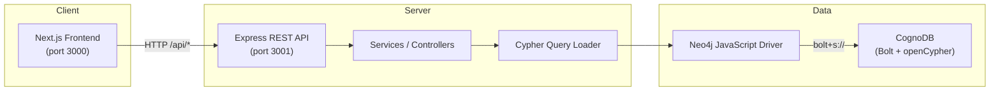
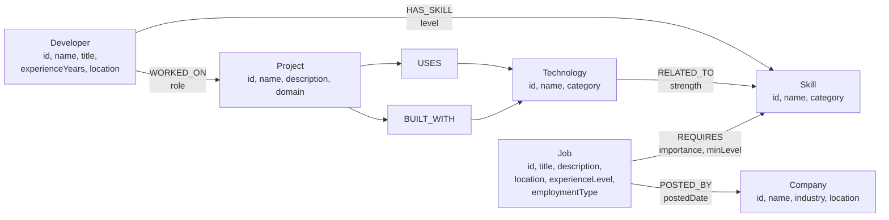

# JobGraph — Job & Skill Graph Explorer

A graph-powered web application for discovering jobs through skills, technologies, and relationships — built for the **Wexa AI CognoDB take-home assignment**.

**Stack:** Next.js · Express · TypeScript · CognoDB (openCypher via the official Neo4j JavaScript driver)

### Hosted URLs

| Service | URL |
|---|---|
| **Backend API** | https://wexa-ai-assignment-ma1t.onrender.com |
| **Health check** | https://wexa-ai-assignment-ma1t.onrender.com/api/health |
| **Frontend** | Netlify — set `NEXT_PUBLIC_API_URL` to the backend URL above |

---

## 1. Overview

Traditional job boards treat listings as flat records: title, company, location, keywords. That works for browsing, but it hides the structure that actually drives hiring — **who requires which skills, which technologies imply those skills, and how people, projects, and companies connect**.

**JobGraph** is a relationship-first job and skill explorer. Instead of keyword search alone, it lets users:

- Browse jobs and skills as **nodes in a graph**
- See **required skills**, **connected technologies**, and **1-hop neighbors** for any entity
- Get **ranked job recommendations** based on skill overlap
- **Walk the graph** one relationship at a time in an interactive explorer

The application reads from a live **CognoDB** instance populated with realistic seed data (developers, skills, jobs, companies, projects, and technologies). All discovery features are powered by **parameterized openCypher** queries — no mock data in the frontend.

---

## 2. Why a Graph Database?

JobGraph’s core problem is **relationship-centric**, not row-centric.

| Domain question | Graph path | Why relationships matter |
|---|---|---|
| Which jobs match my skills? | `Skill ← REQUIRES ← Job` | Jobs are connected to skills by requirement edges, not a shared column |
| What tools sit behind a role? | `Job → REQUIRES → Skill ← RELATED_TO ← Technology` | Technologies relate to skills across a bridge — a 2-hop traversal |
| Who worked with what stack? | `Developer → WORKED_ON → Project → BUILT_WITH → Technology` | Experience is a path through projects and tools |
| What is connected to this skill? | `Skill ← REQUIRES ← Job`, `Technology → RELATED_TO → Skill` | One skill node links hiring demand and tool ecosystems |
| How do I explore the dataset? | 1-hop neighborhood from any node | Native graph operation — not a pile of JOINs per edge type |

### Multi-hop relationships and recommendations

Recommendations in JobGraph are not vector similarity or full-text search. They are **graph overlap**: given a set of skills you select, the app finds jobs whose `REQUIRES` edges point to those skills, ranks by match percentage, and shows which requirements you still miss.

Multi-hop paths matter when the question spans more than one relationship type — for example, discovering **technologies related to a job’s requirements** (Job → Skill → Technology) or, in the seed dataset, tracing how a developer’s **project experience** connects to **skills** through technologies (Developer → Project → Technology → Skill).

### Conceptual comparison with a relational schema

In SQL, the same domain might look like:

```
developers ── developer_skills ── skills
jobs ── job_requirements ── skills
jobs ── companies
projects ── project_technologies ── technologies
technologies ── technology_skills ── skills
```

A 2-hop question (“technologies related to a job’s skills”) becomes:

```sql
SELECT t.*
FROM jobs j
JOIN job_requirements jr ON j.id = jr.job_id
JOIN technology_skills ts ON jr.skill_id = ts.skill_id
JOIN technologies t ON ts.technology_id = t.id
WHERE j.id = ?
```

That is workable for fixed hop counts, but each new path adds JOINs, the query obscures *why* entities connect, and variable-length exploration (“show me everything one step away from this node”) becomes awkward.

**Graph databases are not always better.** For simple CRUD, aggregations over flat tables, or reporting where relationships are static and rarely traversed, PostgreSQL is often the right choice. JobGraph is intentionally graph-shaped because **traversal is the product**.

### Why CognoDB fits this application

[CognoDB](https://cognodb.com/) provides a managed graph database compatible with the **Bolt protocol** and **openCypher** — the same query language used by Neo4j. JobGraph connects with the **official Neo4j JavaScript driver**, which means:

- No custom SDK — standard driver, standard Cypher
- Relationship-first queries stay readable in `.cypher` files
- The assignment’s graph model (typed nodes, directed edges, multi-hop paths) maps directly to the domain

CognoDB is appropriate here because the application’s value is **walking and ranking relationships**, not serving static job rows.

---

## 3. Features

All features below are **implemented and working** against live CognoDB data.

| Feature | Route | Description |
|---|---|---|
| **Dashboard** | `/` | Live counts of jobs, skills, companies, and technologies from the graph |
| **Job browser** | `/jobs` | Search and filter jobs by experience level and employment type |
| **Job detail** | `/jobs/[id]` | Role description, required skills, connected technologies (2-hop), 1-hop graph connections |
| **Skill browser** | `/skills` | Search and filter skills by category; shows job/technology counts per skill |
| **Skill detail** | `/skills/[id]` | Related technologies, jobs requiring the skill, 1-hop graph connections |
| **Recommendations** | `/recommendations` | Select skills → ranked jobs with match %, matched skills, and missing skills |
| **Graph explorer** | `/explore` | Pick any node type, view 1-hop neighbors, click to walk the graph; preset starting points |
| **Health check** | `/api/health` | Backend + CognoDB connectivity status |

**UX included:** loading skeletons, empty states, error states with retry, responsive navigation, graph-path hints on key pages, skip-to-content link.

**Not implemented (by design):** user authentication, job/skill creation UI, admin panel, write API endpoints.

---

## 4. Architecture



**Request flow:** Frontend calls the REST API → controllers validate input → services invoke parameterized Cypher from `backend/src/queries/` → Neo4j driver executes against CognoDB → JSON response `{ success, data, meta? }`.

---

## 5. Graph Data Model

Six node labels and seven directed relationship types. Every node has a stable string `id` with a uniqueness constraint.



**Seed dataset:** 10 developers · 25 skills · 12 jobs · 6 companies · 10 projects · 18 technologies

Full schema reference: [`database/schema/README.md`](database/schema/README.md)  
Diagram source: [`docs/graph-model.md`](docs/graph-model.md)

---

## 6. Technology Stack

| Layer | Technology |
|---|---|
| Frontend | Next.js 15, React 19, TypeScript, Tailwind CSS v4 |
| Backend | Express 4, TypeScript |
| Database | CognoDB (managed graph, Bolt + openCypher) |
| Driver | [neo4j-driver](https://neo4j.com/docs/javascript-manual/current/) v5 |
| Monorepo | npm workspaces (`frontend`, `backend`, `database`) |
| Tooling | ESLint, tsx, concurrently |

---

## 7. Project Structure

```
jobgraph/
├── frontend/                 # Next.js App Router UI
│   └── src/
│       ├── app/              # Pages (jobs, skills, recommendations, explore)
│       ├── components/       # UI, layout, graph components
│       ├── services/         # API client
│       └── types/            # Shared TypeScript types
├── backend/                  # Express REST API
│   └── src/
│       ├── routes/           # Route definitions
│       ├── controllers/      # Request handlers
│       ├── services/         # Business logic
│       ├── queries/          # Parameterized .cypher files
│       ├── db/               # Neo4j driver singleton
│       └── middleware/       # Error handling, async wrapper
├── database/                 # Schema and seed scripts
│   ├── schema/               # Constraints, indexes
│   ├── seed/                 # Idempotent MERGE seed (data.ts, seed.ts)
│   └── queries/              # Reference Cypher (not loaded at runtime)
└── docs/                     # Supplementary documentation
```

---

## 8. CognoDB Setup

### Step 1 — Create a CognoDB account

1. Go to [CognoDB Cloud](https://cognodb.com/) and sign up.
2. Open the console and create a new instance (the free **c0** tier is sufficient).

### Step 2 — Obtain connection details

After provisioning, copy:

| Detail | Example | Notes |
|---|---|---|
| **Bolt URI** | `bolt+s://db-xxxx.databases.cognodb.cloud` | Must use `bolt+s://` (TLS) |
| **Username** | `cognodb` | Default CognoDB username |
| **Password** | *(shown once)* | Save immediately — it cannot be retrieved later |

### Step 3 — Configure environment variables

From the project root:

```bash
cp .env.example .env
```

Edit `.env` with your credentials. **Never commit `.env`.**

### Step 4 — Verify connectivity

```bash
npm run dev:backend
curl http://localhost:3001/api/health
```

Expected when connected:

```json
{
  "success": true,
  "data": {
    "status": "ok",
    "database": "connected"
  }
}
```

See also: [`docs/cognodb-setup.md`](docs/cognodb-setup.md)

---

## 9. Environment Variables

Copy `.env.example` to `.env` at the project root:

```env
# CognoDB connection (used by backend and database seed scripts)
COGNODB_URI=bolt+s://db-your-instance.databases.cognodb.cloud
COGNODB_USERNAME=cognodb
COGNODB_PASSWORD=your-password-here

# Backend
PORT=3001
NODE_ENV=development
CORS_ORIGIN=http://localhost:3000

# Frontend (prefix with NEXT_PUBLIC_ for client-side access)
NEXT_PUBLIC_API_URL=http://localhost:3001

# Production frontend (Netlify) — use the deployed backend:
# NEXT_PUBLIC_API_URL=https://wexa-ai-assignment-ma1t.onrender.com
```

| Variable | Required by | Description |
|---|---|---|
| `COGNODB_URI` | backend, seed | CognoDB Bolt URI (`bolt+s://`) |
| `COGNODB_USERNAME` | backend, seed | Database username |
| `COGNODB_PASSWORD` | backend, seed | Database password |
| `PORT` | backend | API port (default `3001`; Render injects automatically) |
| `CORS_ORIGIN` | backend | Allowed frontend origin (your Netlify URL in production) |
| `NEXT_PUBLIC_API_URL` | frontend | Backend base URL — production: `https://wexa-ai-assignment-ma1t.onrender.com` |

---

## 10. Local Development

### Prerequisites

- Node.js 20+
- A running CognoDB instance

### Install dependencies

```bash
git clone <repository-url>
cd jobgraph
npm install
```

### Apply schema and seed data

Schema constraints, indexes, and all seed nodes/relationships are applied in one idempotent command:

```bash
npm run db:seed
```

Safe to run multiple times — uses parameterized `MERGE` (no duplicates).

### Start both servers

```bash
npm run dev
```

| Service | URL |
|---|---|
| Frontend | http://localhost:3000 |
| Backend API | http://localhost:3001 |

Or run individually:

```bash
npm run dev:backend    # API on :3001
npm run dev:frontend   # UI on :3000
```

### Verify Cypher queries (optional)

```bash
npm run verify:queries
```

Runs 13 queries against live seed data and reports pass/fail.

### Build for production

```bash
npm run build
npm run start -w backend   # after build
npm run start -w frontend  # after build
```

---

## 11. Cypher Queries

All runtime queries live in `backend/src/queries/` as `.cypher` files. They are loaded at startup and executed with **parameterized** `$placeholders` — never string concatenation.

### Basic traversal (1-hop)

**List jobs with company** — `get-all-jobs.cypher`

```cypher
MATCH (j:Job)
OPTIONAL MATCH (j)-[:POSTED_BY]->(c:Company)
RETURN j { ... } AS job, c { ... } AS company
```

**Used by:** `/jobs`, dashboard stats

---

**Skill neighborhood** — `get-skill-related.cypher`

```cypher
MATCH (s:Skill {id: $skillId})
OPTIONAL MATCH (s)<-[:RELATED_TO]-(t:Technology)
OPTIONAL MATCH (s)<-[:REQUIRES]-(j:Job)
RETURN s, collect(DISTINCT t) AS technologies, collect(DISTINCT j) AS jobs
```

**Used by:** `/skills/[id]`

---

### Multi-hop traversal (2-hop)

**Job → connected technologies** — `job-skills-to-technologies.cypher`

```cypher
MATCH (j:Job {id: $jobId})-[req:REQUIRES]->(s:Skill)<-[rel:RELATED_TO]-(t:Technology)
RETURN t, collect(DISTINCT { skillName: s.name, importance: req.importance }) AS viaSkills
```

Path: `Job → REQUIRES → Skill ← RELATED_TO ← Technology`

**Used by:** `/jobs/[id]` (Connected technologies section)

In SQL this requires joining `jobs → job_requirements → skills → technology_skills → technologies`. Cypher keeps the path explicit.

---

### Recommendation query

**Rank jobs by skill overlap** — `recommend-jobs-by-skills.cypher`

```cypher
MATCH (s:Skill) WHERE s.id IN $skillIds
WITH collect(s) AS userSkills, count(s) AS userSkillCount
UNWIND userSkills AS s
MATCH (j:Job)-[req:REQUIRES]->(s)
WITH j, matchedSkills, matchedCount, userSkillCount
OPTIONAL MATCH (j)-[:REQUIRES]->(allReq:Skill)
RETURN j, matchedSkills, matchedCount,
       userMatchPercentage, jobCoveragePercentage, missingSkills
ORDER BY userMatchPercentage DESC
```

Path: `Skill ← REQUIRES ← Job` (aggregated across selected skills)

**Used by:** `/recommendations`

Returns match percentages and `missingSkills` — skills the job requires that you did not select.

---

### Relationship exploration query

**1-hop neighborhood** — `explore-node-neighborhood.cypher`

```cypher
MATCH (center)
WHERE center.id = $nodeId AND $nodeLabel IN labels(center)
OPTIONAL MATCH (center)-[r]-(neighbor)
RETURN center, collect(DISTINCT {
  id: neighbor.id,
  relationship: type(r),
  direction: CASE WHEN startNode(r) = center THEN 'outgoing' ELSE 'incoming' END
}) AS connections
```

**Used by:** `/explore`, job/skill detail sidebars

The `$nodeLabel` parameter is validated against an allowlist in the backend before execution.

---

### Additional queries (verified, not exposed in UI)

These queries exist in the repository and pass `npm run verify:queries`, but are **not** wired to REST endpoints or frontend pages:

| File | Hops | Purpose |
|---|---|---|
| `developer-skills-to-jobs.cypher` | 2 | Developer `HAS_SKILL` skills → matching jobs |
| `developer-project-to-skills.cypher` | 4 | Developer → Project → Technology → inferred Skill |
| `get-jobs-by-skill.cypher` | 1 | Jobs requiring one skill |
| `get-jobs-by-multiple-skills.cypher` | 1 | Jobs matching any of several skills |

Reference-only queries (not loaded by the backend at runtime) are in `database/queries/`.

Full query index: [`backend/src/queries/README.md`](backend/src/queries/README.md)

---

## 12. API Endpoints

**Production:** `https://wexa-ai-assignment-ma1t.onrender.com`  
**Local:** `http://localhost:3001`

All successful responses follow:

```json
{ "success": true, "data": { ... }, "meta": { "count": 12 } }
```

Errors:

```json
{ "success": false, "error": "Human-readable message" }
```

| Method | Endpoint | Description |
|---|---|---|
| `GET` | `/api/health` | API and CognoDB connectivity (`200` ok, `503` disconnected) |
| `GET` | `/api/jobs` | List all jobs with company |
| `GET` | `/api/jobs/recommendations?skills=id1,id2` | Ranked recommendations for selected skill IDs |
| `GET` | `/api/jobs/:id` | Job detail with company and required skills |
| `GET` | `/api/jobs/:id/skills` | Skills required by a job |
| `GET` | `/api/jobs/:id/technologies` | Technologies related via required skills (2-hop) |
| `GET` | `/api/skills` | List all skills with job/technology counts |
| `GET` | `/api/skills/:id/related` | Related technologies and jobs for a skill |
| `GET` | `/api/companies` | List companies with job counts |
| `GET` | `/api/technologies` | List technologies with related-skill and project counts |
| `GET` | `/api/graph/explore?nodeId=&label=` | 1-hop neighborhood (`label`: Developer, Skill, Job, Company, Project, Technology) |

**Example:**

```bash
# Production
curl "https://wexa-ai-assignment-ma1t.onrender.com/api/jobs/recommendations?skills=skill-typescript,skill-react-dev,skill-graph-db"
curl "https://wexa-ai-assignment-ma1t.onrender.com/api/graph/explore?nodeId=skill-graph-db&label=Skill"

# Local
curl "http://localhost:3001/api/jobs/recommendations?skills=skill-typescript,skill-react-dev,skill-graph-db"
curl "http://localhost:3001/api/graph/explore?nodeId=skill-graph-db&label=Skill"
```

---

## 13. Screenshots

<!-- Replace placeholders with actual screenshots before submission -->

| Page | Preview |
|---|---|
| Dashboard |  |
| Jobs list |  |
| Job detail |  |
| Recommendations |  |
| Graph explorer |  |
| Skills |  |

> **Before submission:** capture screenshots from a running instance and save them to `docs/screenshots/`.

---

## 14. Demo

**Backend API (live):** https://wexa-ai-assignment-ma1t.onrender.com  
**Health:** https://wexa-ai-assignment-ma1t.onrender.com/api/health

**Frontend (Netlify):** _Add your Netlify URL here after deploy_

Deployment details: [`docs/deployment.md`](docs/deployment.md)

- **Backend:** Render — `npm run build -w backend` / `npm run start -w backend`
- **Frontend:** Netlify — `NEXT_PUBLIC_API_URL=https://wexa-ai-assignment-ma1t.onrender.com` (configured in `netlify.toml`)
- **Database:** CognoDB seeded (12 jobs, 25 skills)

---

## 15. Screen Recording

<!-- Replace with your recording link before submission -->

**Screen recording:** _Coming soon — https://your-recording-link.example.com_

Suggested walkthrough (3–5 minutes):

1. Dashboard with live graph stats
2. Browse jobs → open a role → show required skills and connected technologies
3. Recommendations → select skills → show ranked matches and missing skills
4. Graph explorer → start at a skill → click through to a job node

---

## 16. Future Improvements

- Expose the 4-hop `developer-project-to-skills` query via API and UI (currently verified offline only)
- Lightweight `/api/stats` endpoint to avoid fetching full lists for dashboard counts
- Add Netlify frontend URL to README once deployed
- Friendly error page when the API is unreachable on server-rendered detail routes
- Pagination if the dataset grows beyond seed scale

---

## License

Private — Wexa AI take-home assignment.
