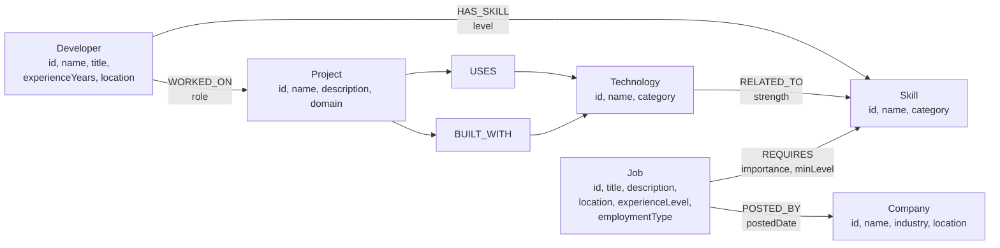

# JobGraph — Job & Skill Graph Explorer

A graph-powered web application that helps users discover jobs based on skills and explore relationships between jobs, skills, technologies, projects, and companies.

Built with **Next.js**, **Express**, and **CognoDB** (openCypher over Bolt via the official Neo4j driver).

## Use case

JobGraph demonstrates relationship discovery — not a generic job portal. Users explore how developers, skills, projects, technologies, and companies connect in a graph, and discover job opportunities through multi-hop traversals.

## Why a graph database?

Traditional relational databases struggle with variable-length path queries like:

- Finding jobs reachable through project technologies that relate to required skills
- Explaining the shortest connection path between a developer and a job
- Exploring skill adjacency across jobs, technologies, and projects

CognoDB makes these relationship-first queries natural and readable with openCypher.

## Data model

JobGraph uses six node labels and seven relationship types. Every node has a stable string `id` with a uniqueness constraint.



Full schema documentation: **[database/schema/README.md](database/schema/README.md)**  
Diagram source: **[docs/graph-model.md](docs/graph-model.md)**

## Project structure

```
jobgraph/
├── frontend/     # Next.js + TypeScript + Tailwind CSS
├── backend/      # Express + TypeScript API
├── database/     # Cypher schema, queries, and seed scripts
└── docs/         # Screenshots and supplementary documentation
```

## Prerequisites

- Node.js 20+
- A CognoDB instance (Bolt URI, username, password)

## Setup

### 1. Clone and install

```bash
git clone <repository-url>
cd jobgraph
npm install
```

### 2. Configure environment

```bash
cp .env.example .env
# Edit .env with your CognoDB credentials
```

### 3. Apply schema and seed data

```bash
npm run db:seed
```

This command is idempotent — safe to run multiple times. It applies constraints/indexes and upserts all seed data using parameterized `MERGE` Cypher.

### 4. Run locally

```bash
npm run dev
```

- Frontend: http://localhost:3000
- Backend API: http://localhost:3001

## CognoDB setup

See **[docs/cognodb-setup.md](docs/cognodb-setup.md)** for full instructions. Summary:

1. Sign up at [CognoDB Cloud](https://cognodb.com/) and create a free **c0** instance.
2. Copy the **`bolt+s://` URI** and **password** (shown once) from the console.
3. Set environment variables in `.env`:

```env
COGNODB_URI=bolt+s://db-your-instance.databases.cognodb.cloud
COGNODB_USERNAME=cognodb
COGNODB_PASSWORD=your-password-here
```

4. Verify connectivity: `curl http://localhost:3001/api/health`
5. Run `npm run db:seed` to apply schema and seed data.

**Never commit `.env` or expose credentials in API responses or logs.**

## Main queries

<!-- TODO: Document flagship Cypher queries with explanations -->

| Query | Purpose |
|---|---|
| Skill → Job matching | Direct job discovery from selected skills |
| Developer → Project → Technology → Skill → Job | Indirect job recommendations (multi-hop) |
| Shortest path (Developer → Job) | Relationship exploration and explanation |

## Screenshots

<!-- TODO: Add application screenshots -->

## Live demo

<!-- TODO: Add hosted demo URL -->

## Screen recording

<!-- TODO: Add screen recording link -->

## License

Private — Wexa AI take-home assignment.
