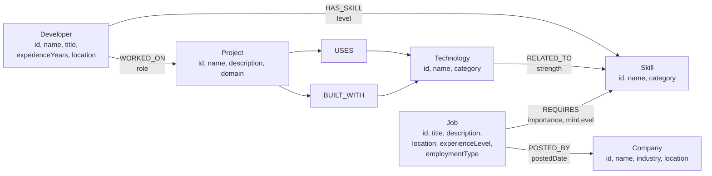

# JobGraph — Graph Data Model Diagram

This diagram is included in the project README and documents the CognoDB schema.



## Relationship summary

| From | Relationship | To | Purpose |
|---|---|---|---|
| Developer | HAS_SKILL | Skill | Profile skills and proficiency |
| Developer | WORKED_ON | Project | Portfolio and experience history |
| Project | USES | Technology | Supporting tools used in delivery |
| Project | BUILT_WITH | Technology | Core stack the project was built on |
| Technology | RELATED_TO | Skill | Maps tools to human capabilities |
| Job | REQUIRES | Skill | Role skill requirements |
| Job | POSTED_BY | Company | Links roles to hiring organizations |

## Example traversals

**Direct job match (1 hop):**
```
Skill ← REQUIRES ← Job
```

**Indirect recommendation (4+ hops):**
```
Developer → WORKED_ON → Project → BUILT_WITH → Technology → RELATED_TO → Skill ← REQUIRES ← Job
```

**Company ecosystem:**
```
Company ← POSTED_BY ← Job → REQUIRES → Skill
```

**Technology discovery from a skill:**
```
Skill ← RELATED_TO ← Technology ← USES ← Project
```
